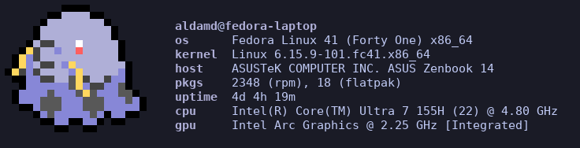
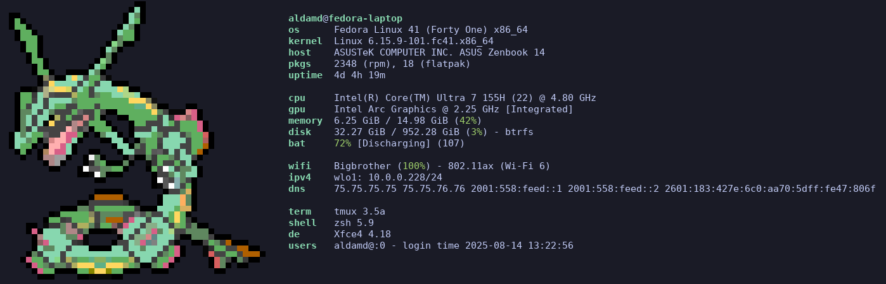

# PokéFetch
PokéFetch is a small integration script that combines [pokemon-colorscript](https://gitlab.com/phoneybadger/pokemon-colorscripts) with [fastfetch](https://github.com/fastfetch-cli/fastfetch).
It dynamically adjusts the fastfetch configuration based on the randomly generated Pokémon’s art size and color palette, so your system info always matches your favorite pocket monster.

## Usage
Put something along these lines in your shell config:
```sh
pokecache='pokemon-colorscripts --no-title > ~/.cache/pokemon.txt'
clear='clear && pokecache && /path/to/pokefetch.py && fastfetch --logo ~/.cache/pokemon.txt'
clear
```

## Examples


